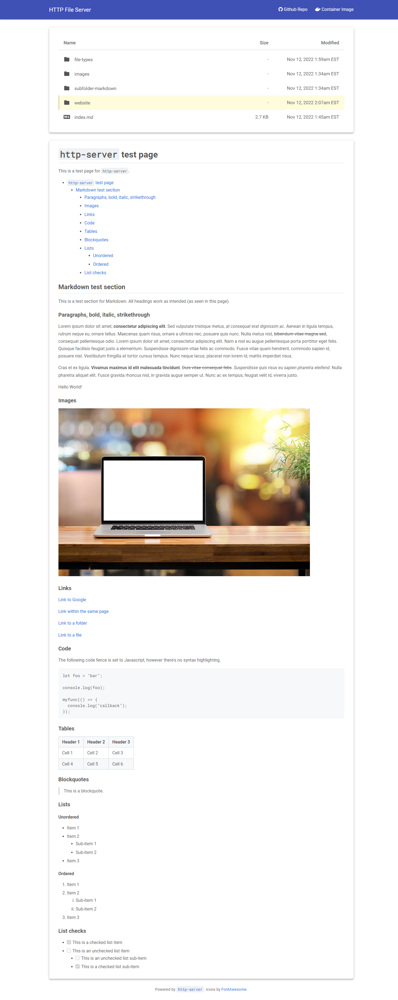
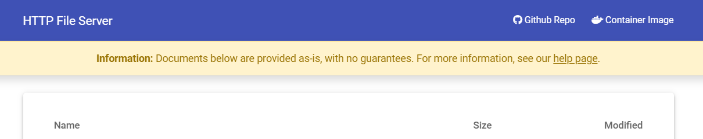

# Directory listing support

If the directory does not contain any `index.html` or `index.htm` file, the `http-server` will render a directory listing page, which will list all the files and folders in the directory, excluding `http-server`'s configuration files.

Old versions of this program would render the contents in the `/html` folder, however, this was changed to a more dynamic approach, since `/html` was not a cross-platform suitable configuration value.

To allow for directory listing mode, folders cannot contain a folder called `_` (underscore). `http-server` reserves underscore folders for the directory listing mode and its assets.

An example of what the directory listing page looks like is below:



### Title change

The page title can be changed with the `--title` option (or one of the available options via environment variables or configuration file). The default value is `HTTP File Server`, but you can change it to whatever you want.

### Hiding developer links

While I would appreciate you leaving the links to this repository, I understand it's not often the case these can be kept. To hide the links, use the `--hide-links` option (or one of the available options via environment variables or configuration file).

### File highlighting

`http-server` includes support for highlighting files in the UI. Useful when you want to direct the end user's attention toward one or more files being shown via the directory listing feature. To "highlight" a file, `CTRL+Shift+Click` (or `CMD+Shift+Click` on macOS) on the file name in the UI. This will add a URL parameter with the files selected and you can share this URL with end users.

Old versions of `http-server` required only using `CTRL` (or `CMD`) and clicking for highlighting, however, this was changed to avoid conflicts with the browser's default behavior of opening the file in a new tab.

Several file extensions include custom icons. More icons can be added provided the Icon Font in use, [Font Awesome](https://fontawesome.com/), supports the icon. If you see a generic file icon and you would like to have an extension to include a custom icon from Font Awesome, please [open an issue](https://github.com/patrickdappollonio/http-server/issues/new).

When file highlighting is in use, Markdown title anchors are not supported, and viceversa.

### Markdown support

When working as a directory listing tool, if the directory contains a `README.md`, `readme.md` or `index.md` file (either with `.md` or `.markdown` extension), it will be rendered as HTML and displayed on the directory listing page. You can choose to render the Markdown contents before or after the directory listing section: by default, it will render _after_ the directory listing. To render it _before_ you can use `--markdown-before-dir`.

The goal of this feature is to quickly provide the option for site operators to provide instructions to end users in the form of a document. You can combine the markdown rendering feature with the file highlighting feature to direct the end user's attention to specific files too, for example.

When using markdown, consider:

* **Features**
  * CommonMark and GitHub Flavored Markdown are supported
  * Mermaid diagrams are supported, and the diagram is rendered centered in the page
  * Code fences are supported
  * Headings will include anchors to quickly jump to the given content
  * Links to files within the directory being printed are also supported
  * Images loaded from the directory in use are supported, as well as 3rd party images
* **Limitations**
  * Raw HTML within markdown files is not supported, and it will be replaced with `<-- raw HTML omitted -->`
  * Code fences' syntax highlighting is not supported
  * Title anchors are not supported when file highlighting is in use, and viceversa

#### Image alignment

Since raw HTML is not supported, `http-server` supports Markdown image alignment. To use it, update the image URL in Markdown to end with one of the following:

* `#align-left` to align the image to the left
* `#align-right` to align the image to the right
* `#align-center` to center the image

If you don't specify an alignment, the image will be set to its own paragraph block. This is different than `#align-left` since this will make the image "float" to the left instead, making the text surround the image.

#### Mermaid diagrams

`http-server` supports Mermaid diagrams. Create a code block with the `mermaid` language, and the diagram will be rendered as an SVG image. Rendering happens client-side, and the Mermaid library (found in [`internal/server/assets`](../internal/server/assets)) is loaded only if a Mermaid code block is found.

### Markdown banner

Another utility to draw attention to specific details is the "banner" feature. In short, it's a yellow stripe that appears right below the page header (the blue one) and allows you to provide a message that shows centered in the stripe. This is useful for providing a warning or a notice to end users.

The message is configured with `--banner`, and it supports a very basic Markdown: only links, bold and italic are supported.

For example, the following command:

```bash
http-server --banner '**Information:** Documents below are provided as-is, with no guarantees. For more information, see our [help page](https://www.example.org).'
```

Will render the following banner:



Only a very limited subset of Markdown is supported including bold, italic and links. Paragraphs are removed. The `banner` feature is meant to be used for simple messages. If you need more complex messages, consider using the Markdown rendering feature instead.

### CORS support

`http-server` supports CORS, which means you can use it to serve files to other domains. This is done by setting the `Access-Control-Allow-Origin` header to `*`. See [CORS requests](./cors-requests.md) for more information.

### Air-gapped environment

`http-server` is self-contained. Previous versions will load specific assets from the web, which made them unsuitable for environments with no internet access or in corporate environments. Starting from version `v2`, all assets are bundled with the binary, and the `http-server` will not load any external assets.

Behaviour-wise, this allows for custom icons in directory listing mode, as well as using the "Roboto" and "Roboto Mono" fonts to render the UI and potential markdown files. For these fonts, the following charsets are supported: `cyrillic`, `cyrillic-ext`, `greek`, `greek-ext`, `latin`, `latin-ext`, and `vietnamese`.
